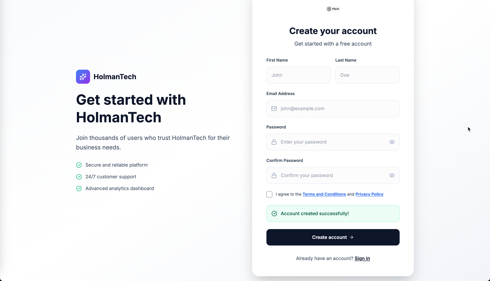

# Dan Holman – Software Developer in Test Portfolio

**Senior Software Developer in Test (SDET) & Automation Architect** with 10+ years of experience
building automation frameworks, cloud-native solutions, and quality platforms at scale.

> **📝 Portfolio Status**: This portfolio was recently created and is actively being developed. While the core functionality and demonstrations are complete, some features and documentation are still being refined. I welcome feedback on the projects and approach!

## 🧪 **[Live Test Results Dashboard](https://dholman7.github.io/danholman-portfolio/)**

**Comprehensive test results, Allure reports, and coverage analysis:**
- **Combined Allure Reports**: Unified test analytics across all modules
- **Individual Module Reports**: Detailed test results for each project
- **Playwright Reports**: Interactive E2E test results with screenshots and videos
- **Coverage Reports**: Code coverage analysis and visualization
- **Real-time Updates**: Automatically updated on every CI/CD run

---

## 📂 Projects

### 🔹 [Automation Framework](./automation-framework)
A comprehensive Python/TypeScript test automation framework showing:
- Page Object design pattern
- GraphQL & REST API testing
- Contract testing with Pact
- **API Matrix Testing**: Advanced parallel API testing with GitHub Actions matrix strategy (pytest-xdist alternative for CI/CD)
- CI/CD integration with GitHub Actions

---

### 🔹 [Cloud-Native App](./cloud-native-app)
An AWS serverless demo app with:
- Lambda + API Gateway + DynamoDB
- Infrastructure as Code (CloudFormation/CDK)
- Integration and contract tests
- GitHub Actions pipeline

---

### 🔹 [AI Rulesets](./ai-rulesets)
Organizational AI rulesets and utilities for creating custom development standards:
- Pre-built rulesets for Python, TypeScript, testing, CI/CD, and security
- Document processing utilities to create custom rulesets from company standards
- Cursor and GitHub Copilot integration for consistent AI assistance
- **🔍 AI-Powered Quality Checker**: Comprehensive validation of README files, GitHub workflows,
  test execution, version consistency, and Allure reporting across all modules
- Ruleset generation and validation tools for organizational standards

---

### 🔹 [React Playwright Demo](./react-playwright-demo)
Modern React 19/TypeScript frontend demo with comprehensive E2E testing:



- React 19 with TypeScript and Vite for modern development
- Tailwind CSS for responsive, accessible UI design
- Playwright E2E testing with interactive HTML reports (http://localhost:9323/)
- Allure reporting integration for test analytics
- GitHub Actions PR preview deployment
- Form validation with react-hook-form and Zod
- Mock API integration for demonstration purposes
- Parallel test execution for faster feedback

---

### 🔹 [Case Studies](./case-studies)
Technical writeups and lessons learned:
- [Contract Testing Strategy](./case-studies/contract-testing.md)
- [Scaling Test Data with AWS Step Functions](./case-studies/test-data-at-scale.md)
- [Improving Reliability with CI/CD Quality Gates](./case-studies/ci-cd-quality-gates.md)

---

## 🚧 Future Work in Progress

### 🤖 TDD AI-Based Test Generation
**Vision**: Intelligent test automation that bridges the gap between requirements and implementation.

**Core Concept**: 
- **Jira Integration**: Pull user stories and requirements directly from Jira tickets
- **Gherkin Generation**: Automatically create Gherkin scenarios and test cases formatted for Test Management Systems
- **Production Code Generation**: Generate production code based on requirements and test scenarios
- **Comprehensive Test Suite**: Automatically generate unit, component, and integration tests that locate and validate developer code

**Technical Approach**:
- **Requirements Parsing**: AI-powered analysis of Jira stories to extract testable scenarios
- **Test Management Integration**: Direct integration with tools like TestRail, Zephyr, or Xray
- **Code Generation Pipeline**: Generate both production code and corresponding test suites
- **Test Discovery**: Intelligent code analysis to locate existing developer implementations
- **Multi-layer Testing**: Generate tests at unit, component, and integration levels
- **CI/CD Integration**: Seamless integration with existing GitHub Actions workflows

**Expected Benefits**:
- **Faster Test Creation**: Reduce test creation time from hours to minutes
- **Requirements Traceability**: Direct link between Jira stories and test cases
- **Comprehensive Coverage**: Ensure all requirements are tested at multiple levels
- **Consistent Quality**: Standardized test patterns across all projects
- **Developer Productivity**: Generate both code and tests simultaneously

**Implementation Phases**:
1. **Phase 1**: Jira API integration and requirements parsing
2. **Phase 2**: Gherkin scenario generation and Test Management System integration
3. **Phase 3**: Production code generation based on requirements
4. **Phase 4**: Intelligent test suite generation with code discovery
5. **Phase 5**: CI/CD integration and quality gates

---

## 🔧 Tech Stack

**Languages:** Python, TypeScript, GraphQL, JavaScript
**Cloud & DevOps:** AWS (Lambda, S3, CloudFormation, Step Functions, RDS), GitHub Actions, Jenkins, TeamCity, Datadog
**Testing Tools:** pytest, Playwright, Selenium, Pact, Jest, Allure, Coverage Reports
**Frontend:** React 19, Vite, Tailwind CSS, react-hook-form, Zod

## 🚀 CI/CD Pipeline

This portfolio demonstrates production-ready CI/CD practices across all modules:

### **Automated Testing & Quality Gates**
- **Multi-language Testing**: Python (pytest) and TypeScript (Jest) test suites
- **Parallel Test Execution**: GitHub Actions matrix strategies for high-scale testing
- **Code Quality**: Automated linting, formatting, type checking, and security scanning
- **Coverage Reporting**: Comprehensive test coverage tracking and reporting

### **Deployment Automation**
- **Infrastructure as Code**: AWS CDK and CloudFormation for reproducible deployments
- **Multi-Environment**: Automated deployments to dev, staging, and production
- **Security Scanning**: Automated dependency and vulnerability scanning
- **Rollback Capabilities**: Safe deployment practices with rollback strategies

### **CI/CD Features Demonstrated**
- **Path-based Triggers**: Efficient CI runs based on changed modules
- **Artifact Management**: Build artifact collection and distribution
- **Environment Management**: Proper secret and configuration management
- **Monitoring Integration**: Test result aggregation and reporting

### **Artifact Path Structure**

The CI/CD pipeline uses a specific artifact pathing structure for reliable report deployment:

#### **Portfolio Test Suite Workflow** (`.github/workflows/portfolio-test-suite.yml`)
- **Working Directories**: Each module runs in its own working directory
- **Artifact Upload Paths**: 
  - Allure Reports: `{module}/reports/allure-report/`
  - Coverage Reports: `{module}/reports/coverage/`
  - Allure Results: `{module}/reports/allure-results/`
- **Artifact Names**: `{module}-allure-report`, `{module}-coverage-report`, `{module}-allure-results`

#### **Deploy Allure Reports Workflow** (`.github/workflows/deploy-allure-reports.yml`)
- **Artifact Download**: Downloads artifacts with pattern `*-allure-report`, `*-coverage-report`
- **Path Mapping**: Handles nested directory structure from working directories
- **GitHub Pages Deployment**: Maps artifacts to `https://dholman7.github.io/danholman-portfolio/{module}/`

#### **Path Resolution Logic**
```bash
# Artifact structure after download:
allure-reports/
├── automation-framework-allure-report/
│   └── automation-framework/reports/allure-report/  # Nested path from working directory
├── ai-rulesets-allure-report/
│   └── ai-rulesets/reports/allure-report/
└── ...

# Deploy workflow handles both possible paths:
# 1. {artifact-name}/{module}/reports/allure-report/
# 2. {artifact-name}/reports/allure-report/
```

📖 **[Detailed CI/CD Documentation](./docs/cicd-overview.md)** -
  Comprehensive overview of all CI/CD practices and patterns

## 🧪 Testing & Reporting Technologies

This portfolio showcases comprehensive testing strategies with multiple reporting formats and real-time feedback:

### **Test Execution & Reporting**
- **Allure Reports**: Comprehensive test reporting with trends, history, and detailed analytics
- **Playwright HTML Reports**: Interactive test results with screenshots, videos, and traces
- **Coverage Reports**: Code coverage analysis with HTML visualization
- **JUnit XML**: Standardized test results for CI/CD integration
- **JSON Reports**: Machine-readable test data for automation

### **Live Reporting URLs**

#### **🎯 [GitHub Pages Test Results Dashboard](https://dholman7.github.io/danholman-portfolio/)**
(CI/CD Generated - Updated on every push)
- **📊 [Combined Allure Reports](https://dholman7.github.io/danholman-portfolio/combined-allure/)**:
  Unified test analytics across all modules
- **🤖 [Automation Framework](https://dholman7.github.io/danholman-portfolio/automation-framework/)**:
  Python/TypeScript test automation results
- **🧠 [AI Rulesets](https://dholman7.github.io/danholman-portfolio/ai-rulesets/)**:
  AI rulesets and quality checker results
- **☁️ [Cloud Native App](https://dholman7.github.io/danholman-portfolio/cloud-native-app/)**:
  AWS serverless testing results
- **⚛️ [React Playwright Demo](https://dholman7.github.io/danholman-portfolio/react-playwright-demo/)**:
  E2E testing with Playwright reports
- **🎬 [Playwright Reports](https://dholman7.github.io/danholman-portfolio/playwright-reports/)**:
  Interactive test results with screenshots and videos
- **📈 [Coverage Reports](https://dholman7.github.io/danholman-portfolio/coverage-reports/)**:
  Code coverage analysis and visualization

#### **Local Development Reports** (Interactive testing during development)
- **Playwright Reports**: http://localhost:9323/ (interactive test results with screenshots/videos)
- **Coverage Reports**: http://localhost:5173/ (code coverage visualization)
- **Allure Reports**: http://localhost:5050-5053 (comprehensive test analytics with trends)

#### **CI/CD Test Failure Diagnosis**
- **GitHub Actions**: View test results, logs, and artifacts directly in PRs
- **Allure Reports**: Historical trends and failure patterns from CI runs
- **Playwright Reports**: Screenshots and videos of failed tests in CI
- **Coverage Reports**: Code coverage changes between commits

### **Testing Technologies Demonstrated**

| Technology | Purpose | Reports | Local Demo | CI/CD Demo |
|------------|---------|---------|------------|------------|
| **Playwright** | E2E Testing | HTML + Allure | http://localhost:9323/ | GitHub Actions + Allure |
| **pytest** | Python Testing | Allure + Coverage | Local + Allure | GitHub Actions + Allure |
| **Jest** | JavaScript Testing | Coverage + Allure | Local + Allure | GitHub Actions + Allure |
| **Coverage.py** | Code Coverage | HTML Reports | http://localhost:5173/ | GitHub Actions |
| **Allure** | Test Analytics | Trend Analysis | Local + GitHub Pages | GitHub Actions + GitHub Pages |

### **Report Features**
- **Real-time Updates**: Reports update automatically with each test run
- **Historical Trends**: Track test performance and stability over time
- **Interactive Dashboards**: Click through test results, screenshots, and traces
- **Coverage Visualization**: See exactly which code is tested
- **Parallel Execution**: Fast test runs with comprehensive reporting

### **CI/CD Test Failure Diagnosis**

This portfolio demonstrates production-ready test failure diagnosis workflows:

#### **GitHub Actions Integration**
- **PR Status Checks**: Tests run automatically on every pull request
- **Artifact Collection**: Screenshots, videos, and logs uploaded for failed tests
- **Matrix Testing**: Parallel execution across multiple environments
- **Failure Notifications**: Immediate feedback on test failures

#### **Diagnostic Capabilities**
- **Screenshot Capture**: Visual evidence of test failures
- **Video Recording**: Step-by-step playback of failed test scenarios
- **Console Logs**: Detailed error messages and stack traces
- **Network Logs**: API call failures and timing issues
- **Coverage Reports**: Identify untested code paths

#### **Historical Analysis**
- **Allure Trends**: Track test stability over time
- **Flaky Test Detection**: Identify unreliable tests
- **Performance Monitoring**: Track test execution times
- **Failure Patterns**: Analyze recurring issues

#### **Quick Access to CI Results**
- **GitHub Actions**: Direct links to test runs in PRs
- **Allure Reports**: Comprehensive test analytics with history
- **Artifact Downloads**: Download test artifacts for local analysis
- **Integration Status**: Real-time test status in GitHub UI

---

### **Report URLs**

#### **🎯 [Live GitHub Pages Test Results Dashboard](https://dholman7.github.io/danholman-portfolio/)**
- **📊 [Combined Allure Reports](https://dholman7.github.io/danholman-portfolio/combined-allure/)**: Unified test analytics
- **🤖 [Automation Framework](https://dholman7.github.io/danholman-portfolio/automation-framework/)**: Test automation results
- **🧠 [AI Rulesets](https://dholman7.github.io/danholman-portfolio/ai-rulesets/)**: AI quality checker results
- **☁️ [Cloud Native App](https://dholman7.github.io/danholman-portfolio/cloud-native-app/)**: AWS serverless results
- **⚛️ [React Playwright Demo](https://dholman7.github.io/danholman-portfolio/react-playwright-demo/)**: E2E testing results
- **🎬 [Playwright Reports](https://dholman7.github.io/danholman-portfolio/playwright-reports/)**: Interactive test results
- **📈 [Coverage Reports](https://dholman7.github.io/danholman-portfolio/coverage-reports/)**: Code coverage analysis

#### **Local Development Reports**

After running `make allure-serve-local`, access reports at:
- **Automation Framework**: http://localhost:5050
- **AI Rulesets**: http://localhost:5051
- **Cloud Native App**: http://localhost:5052
- **React Playwright Demo**: http://localhost:5053

### **History Support**

The local setup maintains test execution history for trend analysis:
- **Trend Charts**: Track test results over time
- **Flaky Test Detection**: Identify unstable tests
- **Performance Trends**: Monitor test execution times
- **Failure Patterns**: Analyze recurring test failures

### **Module-Specific Testing**

```bash
# Test specific modules
make -C automation-framework test-allure
make -C ai-rulesets test-allure
make -C cloud-native-app test-allure
make -C react-playwright-demo test-allure

# Serve individual module reports
make allure-serve-single MODULE=automation-framework
make allure-serve-single MODULE=react-playwright-demo
```

### **CI/CD Test Suite**

This portfolio includes a comprehensive CI/CD test suite that can be run manually or automatically:

#### **Manual Test Execution**
Visit the [GitHub Actions page](https://github.com/dholman7/danholman-portfolio/actions/workflows/portfolio-test
  -suite.yml) to run the complete test suite manually with custom options:

- **Module Selection**: Choose specific modules or run all
- **Test Type Filtering**: Unit, integration, E2E, or performance tests
- **Allure Reporting**: Enable/disable comprehensive test analytics
- **Real-time Results**: View live test execution and results

#### **Automatic Execution**
Tests run automatically on:
- **Push to main**: Full test suite execution
- **Pull Requests**: Comprehensive testing with path-based triggers
- **Code Changes**: Smart execution based on modified files

### **Development Workflow**

```bash
# Complete development workflow
make install-dev          # Install dependencies
make test-allure-local    # Run tests with Allure
make allure-serve-local   # View reports with history
```

## 🔧 Troubleshooting CI/CD Issues

### **Artifact Path Issues**

If you see "Reports will be available after test execution" on GitHub Pages, check these common issues:

#### **Issue 1: Artifact Path Mismatch**
- **Problem**: Deploy workflow can't find artifacts due to nested directory structure
- **Cause**: Working directories create nested paths in artifacts
- **Solution**: Deploy workflow handles both possible paths automatically

#### **Issue 2: Missing Allure Reports**
- **Problem**: No Allure reports generated during test execution
- **Cause**: Tests may have failed or Allure generation step failed
- **Solution**: Check GitHub Actions logs for test execution and Allure generation steps

#### **Issue 3: Coverage Reports Not Found**
- **Problem**: Coverage reports show placeholder pages
- **Cause**: Coverage generation failed or path resolution issues
- **Solution**: Verify pytest coverage commands and artifact upload paths

#### **Debug Steps**
1. **Check GitHub Actions**: View the "Portfolio Test Suite with Coverage" workflow run
2. **Verify Artifacts**: Look for uploaded artifacts in the Actions tab
3. **Check Deploy Logs**: Review the "Deploy Allure Reports to GitHub Pages" workflow logs
4. **Path Structure**: Ensure artifacts follow the documented path structure

### **Path Structure Reference**

```bash
# Expected artifact structure:
allure-reports/
├── automation-framework-allure-report/
│   └── automation-framework/reports/allure-report/
├── ai-rulesets-allure-report/
│   └── ai-rulesets/reports/allure-report/
└── ...

# Deploy workflow handles both paths:
# 1. {artifact-name}/{module}/reports/allure-report/
# 2. {artifact-name}/reports/allure-report/
```

## 🔍 Code Quality Validation

This portfolio includes a **comprehensive code quality checker** that automates the validation of:
- **README files**: Accuracy, broken links, outdated references, and structure
- **GitHub workflows**: YAML syntax, required fields, and best practices
- **Test execution**: Coverage, reporting, and integration across all modules
- **Allure reporting**: Configuration and report generation validation

### **Quick Quality Check**
```bash
# Run comprehensive quality validation
make quality-check

# Check specific aspects
make quality-readmes      # README validation
make quality-workflows    # Workflow validation
make quality-tests        # Test execution validation

# Automatically fix common issues
make quality-fix          # Check and fix issues automatically

# Or run directly
python scripts/quality_checker.py
python scripts/quality_checker.py --fix
```

### **Quality Checker Features**
- **37 different validation checks** across all aspects of code quality
- **Automatic fixing** of common issues like trailing whitespace, outdated references, and deprecated actions
- **Severity levels**: Errors (critical), Warnings (should fix), Info (nice to have)
- **CI/CD integration** with fail-on-error and JSON export options
- **Detailed reporting** with file paths, line numbers, and actionable feedback
- **Extensible design** for custom validation rules and organizational standards

## 🚀 Running All Tests

This portfolio provides multiple ways to run tests across all modules:

### **Quick Test Execution**

```bash
# Run all tests for all modules
make test

# Run comprehensive regression tests
make test-regression

# Run tests with Allure reporting
make test-allure

# Quick smoke tests only
make test-allure-quick
```

### **Individual Module Testing**

```bash
# Test specific modules
make -C automation-framework test
make -C ai-rulesets test
make -C cloud-native-app test
make -C react-playwright-demo test

# Test with Allure reporting
make -C automation-framework test-allure
make -C ai-rulesets test-allure
make -C cloud-native-app test-allure
make -C react-playwright-demo test-allure
```

### **Allure Report Generation**

```bash
# Generate Allure reports for all modules
make allure-generate

# Serve reports locally with history
make allure-serve-local

# Serve reports using Docker (no Java required)
make allure-docker-serve

# Serve specific module reports
make allure-serve-single MODULE=automation-framework
make allure-serve-single MODULE=ai-rulesets
make allure-serve-single MODULE=cloud-native-app
make allure-serve-single MODULE=react-playwright-demo
```

### **Available Test Commands**

| Command | Description |
|---------|-------------|
| `make test` | Run all tests for all modules |
| `make test-regression` | Run comprehensive regression tests |
| `make test-allure` | Run tests and generate Allure reports |
| `make test-allure-local` | Run tests with Allure and maintain history |
| `make test-allure-quick` | Quick smoke tests with Allure |
| `make allure-serve-local` | Serve Allure reports with history |
| `make allure-docker-serve` | Serve reports using Docker |
| `make allure-clean` | Clean all Allure reports |

---

## 📫 Connect

- 💼 [LinkedIn](https://linkedin.com/in/danxholman)
- 📧 [danxholman@gmail.com](mailto:danxholman@gmail.com)

---

## AI-Powered Development: Concepts and How-To

This portfolio demonstrates how AI tools can accelerate development workflows and improve code quality. Here's how to leverage AI effectively in your coding practice.

### GitHub Copilot Integration

GitHub Copilot is an AI pair programmer that helps you write code faster and with fewer errors. This portfolio shows practical examples of Copilot usage:

- **Code Generation**: Generate boilerplate code, tests, and documentation
- **Pattern Recognition**: Learn from existing code patterns in the repository
- **Multi-language Support**: Works across Python, TypeScript, JavaScript, and more
- **Context Awareness**: Understands your codebase and suggests relevant solutions

**Best Practices with Copilot:**
- Review all generated code before committing
- Use descriptive comments to guide Copilot's suggestions
- Leverage Copilot for repetitive tasks and test generation
- Combine with manual coding for complex logic

### Cursor AI Editor

Cursor is an AI-powered code editor that provides intelligent code completion and natural language editing capabilities. This repository is optimized for Cursor usage:

**Key Features Demonstrated:**
- **Repo-wide Code Awareness**: Cursor understands the entire codebase context
- **Natural Language Editing**: Describe what you want to build in plain English
- **Intelligent Autocomplete**: Context-aware code suggestions
- **Multi-file Editing**: Make changes across multiple files simultaneously

**Cursor Rules Configuration**
This repository includes a modular [`.cursor/rules/`](.cursor/rules/) configuration that provides Cursor with project-specific context and coding standards:

- **[my-project-rule.mdc](.cursor/rules/my-project-rule.mdc)**: Main project overview and general guidelines
- **[python-development.mdc](.cursor/rules/python-development.mdc)**: Python 3.13 development rules and best practices
- **[typescript-development.mdc](.cursor/rules/typescript-development.mdc)**: TypeScript/Node.js rules and modern ES6+ patterns
- **[testing-guidelines.mdc](.cursor/rules/testing-guidelines.mdc)**: Comprehensive testing guidelines for pytest, Jest, and automation
- **[git-workflow.mdc](.cursor/rules/git-workflow.mdc)**: Git workflow, pull request, and version control rules
- **[ci-cd-infrastructure.mdc](.cursor/rules/ci-cd-infrastructure.mdc)**: CI/CD, infrastructure, and deployment rules
- **[makefile-best-practices.mdc](.cursor/rules/makefile-best-practices.mdc)**: Best practices for Python virtual environment management in Makefiles
- **[ai-rulesets](ai-rulesets/)**: Organizational AI rulesets and utilities for creating custom development standards

**Cursor CLI in GitHub Actions**
This portfolio demonstrates advanced AI integration in CI/CD pipelines using [Cursor CLI](https://docs.cursor.com/en/cli/github-actions):

- **Automated Test Fixes**: Cursor CLI automatically analyzes and fixes test failures in CI
- **CI/CD Issue Debugging**: AI-powered diagnosis and fixing of complex CI/CD problems like artifact path resolution
- **Intelligent Code Analysis**: AI-powered diagnosis of import errors, API compatibility issues, and test logic problems
- **Restricted Autonomy**: Safe AI integration that modifies files without committing or pushing changes
- **Multi-language Support**: Works with Python, TypeScript, and React test suites
- **Configurable Integration**: Optional Cursor CLI fixes can be enabled/disabled per workflow run

**Advanced CI/CD Debugging Capabilities:**
- **Artifact Path Resolution**: AI automatically fixes complex nested directory structure issues
- **Report Generation Issues**: AI diagnoses and fixes Allure, coverage, and other report generation problems
- **Deployment Problems**: AI identifies and resolves GitHub Pages deployment issues
- **Multi-Module Understanding**: AI understands relationships between different modules and their CI/CD requirements

**Setup Requirements:**
1. **API Key**: Add `CURSOR_API_KEY` to your GitHub repository secrets
2. **Workflow**: Use `portfolio-test-suite-with-cursor.yml` for AI-enhanced testing
3. **Configuration**: Cursor CLI uses the repository's `.cursor/rules/` for context-aware fixes

**Example Workflow Integration:**
```yaml
- name: Fix Test Failures with Cursor
  if: failure() && github.event.inputs.enable_cursor_fixes != false
  env:
    CURSOR_API_KEY: ${{ secrets.CURSOR_API_KEY }}
  run: |
    cursor-agent -p "IMPORTANT: Do NOT create branches, commit, push, or post PR comments. 
    Only modify files in the working directory. 
    Analyze test failures and fix Python/TypeScript test files. 
    Focus on import errors, method mismatches, and API compatibility issues."
```

> **Learn More**: See the [official Cursor CLI documentation](https://docs.cursor.com/en/cli/github-actions) for advanced configuration and autonomy levels.

### AI-Assisted Testing

The [AI Rulesets](./ai-rulesets) module demonstrates how to create organizational AI standards:

- **Organizational Standards**: Pre-built rulesets for consistent development practices
- **Custom Ruleset Generation**: Process company documentation into AI-compatible rulesets
- **Multi-tool Integration**: Generate rulesets for Cursor, Copilot, and other AI tools
- **Team Distribution**: Share and maintain standards across development teams

### Getting Started with AI Development

1. **Choose Your AI Tool**: Start with GitHub Copilot for code completion or Cursor for full AI editing
2. **Set Up Context**: Use the `.cursor/rules/` configuration to provide project context
3. **Start Small**: Begin with simple tasks like generating tests or documentation
4. **Iterate and Learn**: Review AI suggestions and refine your prompts
5. **Scale Up**: Gradually use AI for more complex development tasks

### Best Practices

- **Always Review**: Never blindly accept AI-generated code
- **Provide Context**: Give clear, specific instructions to AI tools
- **Maintain Quality**: Use AI to enhance, not replace, good coding practices
- **Stay Updated**: AI tools evolve rapidly, keep up with new features
- **Security First**: Be cautious with AI-generated code in security-sensitive areas

> **Learn More**: Visit [Cursor.com](https://cursor.com/) for the latest AI coding features and [GitHub Copilot](https://github.com/features/copilot) for pair programming assistance.

