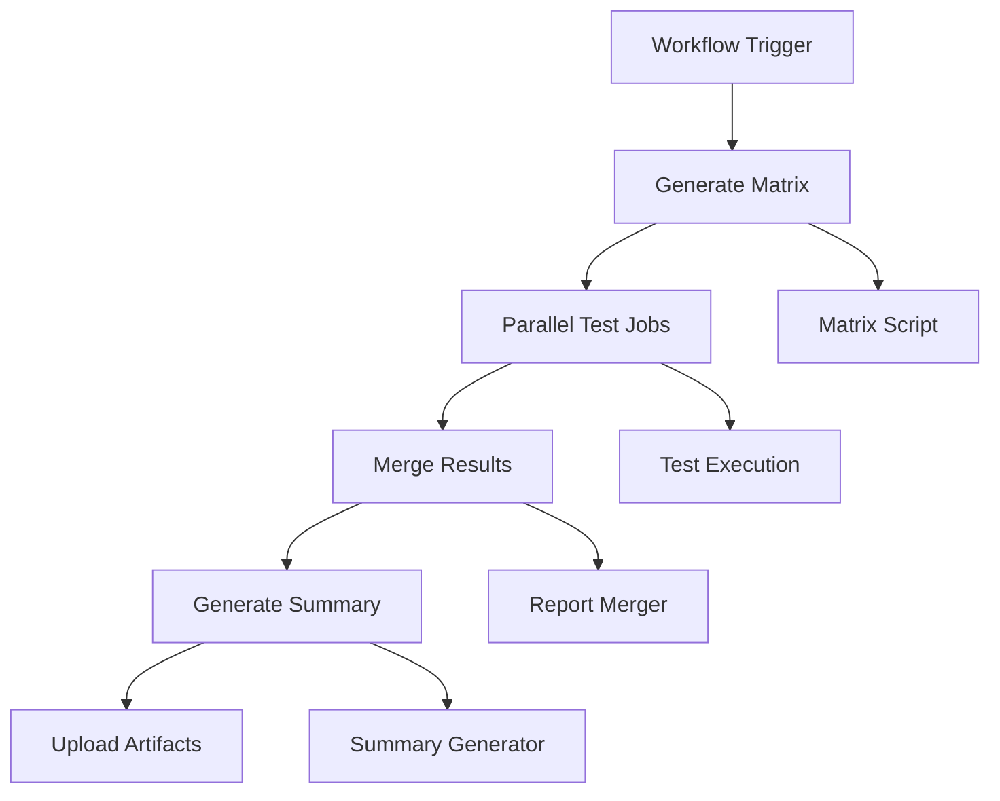

# Parallel Testing with GitHub Actions Matrix

This document demonstrates how to implement high-scale parallel testing using GitHub Actions matrix strategies, inspired by real-world production testing patterns.

## Overview

The parallel testing workflow (`parallel-testing.yml`) showcases advanced CI/CD patterns for:

- **Dynamic Matrix Generation**: Creating test matrices based on available test configurations
- **Parallel Execution**: Running tests across multiple dimensions simultaneously
- **Artifact Management**: Collecting and merging results from parallel jobs
- **Comprehensive Reporting**: Generating detailed test summaries and insights

## Architecture



## Key Features

### 1. Dynamic Matrix Generation

The `generate_test_matrix.py` script creates test configurations based on:

- **Test Types**: unit, component, integration, e2e, api, contract
- **Frameworks**: pytest, jest
- **Languages**: python, typescript
- **Categories**: core, api, rest, graphql, pact
- **Environments**: staging, production

### 2. Parallel Execution Strategy

```yaml
strategy:
  fail-fast: false
  max-parallel: 10  # Configurable via workflow inputs
  matrix:
    test_config: ${{ fromJSON(needs.generate-matrix.outputs.matrix) }}
```

### 3. Comprehensive Test Coverage

The matrix includes:

- **Python Tests**: pytest-based unit, component, integration, and e2e tests
- **TypeScript Tests**: Jest-based unit and integration tests  
- **API Tests**: REST and GraphQL endpoint testing
- **Contract Tests**: Pact-based consumer/provider verification

## Usage

### Manual Trigger

```bash
# Trigger with specific scope
gh workflow run parallel-testing.yml -f test_scope=python -f max_parallel=5

# Trigger all tests
gh workflow run parallel-testing.yml -f test_scope=all -f max_parallel=20
```

### Workflow Inputs

| Input | Type | Options | Default | Description |
|-------|------|---------|---------|-------------|
| `test_scope` | choice | all, python, typescript, api, contract | all | Test scope to execute |
| `max_parallel` | string | 1-20 | 10 | Maximum parallel jobs |

### Environment Variables

| Variable | Description |
|----------|-------------|
| `TEST_TYPE` | Type of test (unit, integration, etc.) |
| `TEST_FRAMEWORK` | Testing framework (pytest, jest) |
| `TEST_LANGUAGE` | Programming language (python, typescript) |
| `TEST_CATEGORY` | Test category (core, api, etc.) |

## Matrix Configuration Examples

### Python Testing Matrix

```json
[
  {
    "type": "unit",
    "framework": "pytest",
    "language": "python",
    "category": "core",
    "environment": "staging",
    "job_name": "unit_pytest_python_core_staging"
  },
  {
    "type": "integration", 
    "framework": "pytest",
    "language": "python",
    "category": "api",
    "environment": "staging",
    "job_name": "integration_pytest_python_api_staging"
  }
]
```

### TypeScript Testing Matrix

```json
[
  {
    "type": "unit",
    "framework": "jest",
    "language": "typescript", 
    "category": "core",
    "environment": "staging",
    "job_name": "unit_jest_typescript_core_staging"
  }
]
```

## Test Execution Patterns

### Python Test Execution

```bash
pytest tests/ \
  --html=reports/${JOB_NAME}.html \
  --self-contained-html \
  --cov=ai_test_generation \
  --cov-report=xml:reports/${JOB_NAME}_coverage.xml \
  --cov-report=html:reports/${JOB_NAME}_coverage.html \
  --junitxml=reports/${JOB_NAME}.xml \
  -v
```

### TypeScript Test Execution

```bash
npm test -- --coverage --outputFile=reports/${JOB_NAME}_coverage.xml
```

## Artifact Management

### Generated Artifacts

Each parallel job generates:

- **HTML Reports**: Detailed test execution reports
- **XML Reports**: JUnit-compatible test results
- **Coverage Reports**: Code coverage metrics
- **JSON Reports**: Structured test data

### Artifact Merging

The workflow includes sophisticated artifact merging:

1. **HTML Report Merging**: Combines individual test reports into a single comprehensive report
2. **JUnit XML Merging**: Aggregates test results across all parallel jobs
3. **Coverage Aggregation**: Combines coverage metrics from multiple test runs
4. **Summary Generation**: Creates markdown summaries with statistics and insights

## Performance Characteristics

### Scalability

- **Parallel Jobs**: Up to 20 concurrent test executions
- **Matrix Size**: Configurable based on test scope
- **Resource Usage**: Optimized with dependency caching
- **Execution Time**: Significantly reduced through parallelization

### Resource Optimization

```yaml
- name: Cache dependencies
  uses: actions/cache@v3
  with:
    path: |
      ~/.cache/pip
      ~/.cache/pytest
    key: ${{ runner.os }}-${{ matrix.test_config.language }}-${{ matrix.test_config.framework }}-${{ hashFiles('**/requirements.txt') }}
```

## Monitoring and Reporting

### Test Summary Features

- **Overall Statistics**: Total tests, success rate, execution time
- **Category Breakdown**: Performance by test type and framework
- **Coverage Analysis**: Code coverage metrics and trends
- **Failure Analysis**: Detailed breakdown of test failures
- **Recommendations**: Actionable insights for test improvement

### Example Summary Output

```markdown
# 🧪 Parallel Test Execution Summary

## 📊 Overall Statistics

| Metric | Value |
|--------|-------|
| **Total Tests** | 1,247 |
| **Passed** | 1,203 |
| **Failed** | 32 |
| **Errors** | 12 |
| **Success Rate** | 96.5% |
| **Total Execution Time** | 45.2s |
| **Average Coverage** | 87.3% |
```

## Best Practices

### 1. Test Organization

- Group tests by type and framework
- Use consistent naming conventions
- Implement proper test isolation
- Include comprehensive test data

### 2. Matrix Design

- Keep matrix dimensions manageable
- Use meaningful job names
- Include environment-specific configurations
- Implement proper error handling

### 3. Resource Management

- Use dependency caching effectively
- Optimize test execution time
- Monitor resource usage
- Implement proper cleanup

### 4. Reporting

- Generate comprehensive reports
- Include actionable insights
- Track trends over time
- Integrate with monitoring systems

## Troubleshooting

### Common Issues

1. **Matrix Too Large**: Reduce `max_parallel` or scope
2. **Resource Exhaustion**: Optimize test execution or reduce parallelism
3. **Artifact Conflicts**: Ensure unique job names
4. **Test Failures**: Check test isolation and dependencies

### Debugging

```bash
# Check matrix generation
python scripts/generate_test_matrix.py --scope python --output debug_matrix.json

# Validate test artifacts
find downloaded_artifacts -name "*.xml" -exec echo "Found: {}" \;

# Test report merging locally
python scripts/merge_junit_reports.py test_artifacts/ merged_report.xml
```

## Integration with Other Systems

### CI/CD Integration

- **GitHub Actions**: Native matrix strategy support
- **Jenkins**: Compatible with parallel execution plugins
- **TeamCity**: Matrix build configurations
- **Azure DevOps**: Multi-configuration builds

### Monitoring Integration

- **Datadog**: Custom metrics and dashboards
- **Grafana**: Test execution visualization
- **Splunk**: Log aggregation and analysis
- **New Relic**: Performance monitoring

## Advanced Patterns

### Conditional Matrix Generation

```python
def generate_conditional_matrix(pr_files: List[str]) -> List[Dict]:
    """Generate matrix based on changed files in PR."""
    matrix = []
    
    if any("python" in f for f in pr_files):
        matrix.extend(python_configs)
    
    if any("typescript" in f for f in pr_files):
        matrix.extend(typescript_configs)
    
    return matrix
```

### Environment-Specific Testing

```yaml
strategy:
  matrix:
    environment: [staging, production]
    test_type: [smoke, regression, performance]
```

### Resource-Aware Execution

```yaml
strategy:
  matrix:
    test_config: ${{ fromJSON(needs.generate-matrix.outputs.matrix) }}
  max-parallel: ${{ github.repository_owner == 'danholman' && 20 || 5 }}
```

This parallel testing implementation demonstrates production-ready patterns for high-scale test automation, providing both technical depth and practical applicability for modern CI/CD pipelines.
