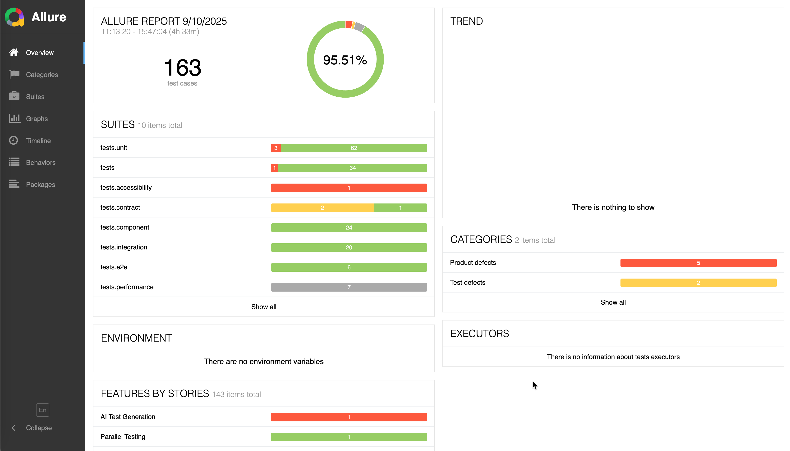

# Pytest Automation Framework

A scalable, production-ready test automation framework built with pytest, demonstrating best practices for test automation at scale.

## 🚀 CI/CD Pipeline

This framework includes a comprehensive CI/CD pipeline demonstrating production-ready testing practices:

### **Automated Testing Pipeline**
- **Python Testing**: Comprehensive testing with Python 3.11
- **Parallel Test Execution**: Matrix strategy for efficient test distribution
- **Code Quality Gates**: Automated linting, formatting, type checking, and security scanning
- **Comprehensive Test Coverage**: Unit, integration, API, UI, performance, and contract tests

### **Quality Assurance**
- **Security Scanning**: Bandit and Safety for vulnerability detection
- **Code Quality**: Black, isort, flake8, Ruff, and MyPy for code standards
- **Test Reporting**: HTML, XML, and coverage reports with artifact management
- **Docker Integration**: Isolated testing environment with mock services

### **Deployment Automation**
- **Multi-Environment Support**: Development, staging, and production deployments
- **Artifact Management**: Build artifact collection and distribution
- **Smoke Testing**: Automated post-deployment validation
- **Rollback Capabilities**: Safe deployment practices with rollback strategies

### **CI/CD Features**
- **Path-based Triggers**: Efficient CI runs based on changed files
- **Matrix Strategies**: Parallel execution across multiple dimensions
- **Artifact Aggregation**: Comprehensive test result collection and reporting
- **Environment Management**: Proper secret and configuration handling

### **Parallel Testing**
- **Dynamic Matrix Generation**: Automatically discovers and configures test executions
- **Multi-Environment Testing**: Run tests across staging and production simultaneously
- **Cross-Browser Testing**: Chrome, Firefox, Edge with desktop/mobile/tablet combinations
- **Test Type Coverage**: Unit, integration, e2e, and performance tests in parallel
- **Result Aggregation**: Comprehensive merging of Allure, HTML, and XML reports
- **Scalable Execution**: Configurable parallel job limits for optimal resource usage

## 🚀 Features

### Core Capabilities
- **Multi-Platform Testing**: Web, API, Mobile, and Database testing
- **Scalable Architecture**: Designed for teams and enterprise use
- **Page Object Model**: Clean, maintainable UI test structure
- **Data-Driven Testing**: Flexible test data management with factories
- **Parallel Execution**: Built-in support for parallel test execution
- **Comprehensive Reporting**: HTML, XML, and Allure reports
- **CI/CD Ready**: Comprehensive GitHub Actions pipeline with parallel execution
- **API Matrix Testing**: Advanced parallel API testing with GitHub Actions matrix strategy

### Testing Types Supported
- **API Testing**: REST and GraphQL with retry logic and authentication
- **UI Testing**: Selenium WebDriver with multiple browser support
- **Contract Testing**: Pact integration for microservices
- **Performance Testing**: Load testing with Locust integration
- **Accessibility Testing**: Axe integration for WCAG compliance
- **Visual Testing**: Screenshot comparison and visual regression
- **Database Testing**: SQLAlchemy integration with multiple databases

### Advanced Features
- **Test Data Factories**: Faker-based realistic data generation
- **Configuration Management**: Environment-based configuration
- **Logging & Monitoring**: Structured logging with Datadog integration
- **Security Testing**: Bandit and Safety integration
- **Code Quality**: Black, isort, flake8, mypy, and Ruff
- **Docker Integration Testing**: Complete isolated test environment with mock services
- **Cloud Integration**: AWS, Azure, and GCP support

## 📁 Project Structure

```
automation-framework/
├── src/                          # Framework source code
│   ├── config/                   # Configuration management
│   │   ├── __init__.py
│   │   └── settings.py          # Environment-based settings
│   ├── core/                     # Core framework components
│   │   ├── __init__.py
│   │   └── base_page.py         # Page Object Model base class
│   ├── api/                      # API testing utilities
│   │   ├── __init__.py
│   │   └── client.py            # HTTP and GraphQL clients
│   ├── data/                     # Test data management
│   │   ├── __init__.py
│   │   └── factories.py         # Test data factories
│   └── utils/                    # Utility functions
│       ├── __init__.py
│       ├── logger.py            # Logging utilities
│       └── helpers.py           # Helper functions
├── tests/                        # Test suites
│   ├── __init__.py
│   ├── test_api_examples.py     # API test examples
│   ├── test_ui_examples.py      # UI test examples
│   └── test_performance.py      # Performance test examples
├── test_data/                    # Test data files
├── reports/                      # Test reports
├── conftest.py                  # Pytest configuration
├── pytest.ini                  # Pytest settings
├── pyproject.toml              # Project configuration
├── requirements.txt            # Dependencies
└── README.md                   # This file
```

## 🛠️ Installation

### Prerequisites

This framework requires Python 3.11+ and Docker for integration testing. We recommend using pyenv to manage Python versions. The project includes a `.python-version` file that specifies the required Python version.

**Python 3.11+ Installation:**
```bash
# Install pyenv (if not already installed)
curl https://pyenv.run | bash

# Install Python 3.11
pyenv install 3.11

# Set Python 3.11 as the local version for this project
pyenv local 3.11
```

**Docker Installation (Required for Integration Tests):**
```bash
# macOS
brew install --cask docker

# Ubuntu/Debian
sudo apt-get update
sudo apt-get install docker.io docker-compose

# Windows
# Download Docker Desktop from https://www.docker.com/products/docker-desktop

# Verify installation
docker --version
docker-compose --version
```

### Quick Start

1. **Clone the repository**
   ```bash
   git clone https://github.com/danholman/pytest-automation-framework.git
   cd pytest-automation-framework
   ```

2. **Install dependencies using Make**
   ```bash
   make install-dev
   ```

   This will:
   - Check your Python version matches the `.python-version` file
   - Create a virtual environment with the correct Python version
   - Install all development dependencies

3. **Set up environment variables**
   ```bash
   cp .env.example .env
   # Edit .env with your configuration
   ```

4. **Run tests**
   ```bash
   make test
   ```

### Development Setup

1. **Install development dependencies**
   ```bash
   make install-dev
   ```

2. **Set up pre-commit hooks**
   ```bash
   pre-commit install
   ```

3. **Run code quality checks**
   ```bash
   make lint
   make format
   make type-check
   ```

### Python Version Management

This project uses pyenv for Python version management. The `.python-version` file specifies the required Python version (3.11).

**Benefits of using pyenv:**
- Consistent Python versions across development environments
- Easy switching between Python versions
- Automatic version detection when entering the project directory
- Prevents version conflicts between projects

**Available Make commands:**
- `make check-python` - Verify the active Python version matches `.python-version`
- `make install` - Install dependencies with Python version check
- `make install-dev` - Install development dependencies with Python version check

## 🧪 Usage Examples

### API Testing

```python
import pytest
from src.api.client import APIClient

@pytest.mark.api
def test_create_user(api_client: APIClient):
    """Test creating a new user via API."""
    user_data = {
        "first_name": "John",
        "last_name": "Doe",
        "email": "john.doe@example.com"
    }

    response = api_client.post("/api/users", data=user_data)

    assert response.status_code == 201
    assert response.data["email"] == user_data["email"]
    assert response.response_time < 2.0
```

### API Matrix Testing

The framework includes advanced API matrix testing capabilities for comprehensive parallel API testing:

```python
import allure
import pytest

@allure.feature("Students API")
@allure.story("List Students")
@pytest.mark.api
@pytest.mark.students
@pytest.mark.list
def test_list_students(self, api_client, test_data):
    """Test listing all students"""
    with allure.step("GET /api/v1/students"):
        response = api_client.get('/api/v1/students')
    
    with allure.step(f"Verify response status is {EXPECTED_STATUS}"):
        assert response.status_code == EXPECTED_STATUS
```

**Features:**
- ✅ **Parallel Execution**: GitHub Actions matrix strategy for high-scale parallel testing
- ✅ **Dynamic Test Filtering**: Configurable test execution based on API type, environment, and scenario
- ✅ **Comprehensive Reporting**: HTML, JUnit XML, and Allure reports with artifact management
- ✅ **Multi-Environment Support**: Dev, staging, and production environment testing
- ✅ **CI/CD Integration**: Automated testing with PR integration and test result summaries

**Supported API Types:**
- **Students**: Complete CRUD operations for student management
- **Courses**: Complete CRUD operations for course management
- **Enrollments**: Student-course enrollment operations

For detailed API Matrix Testing documentation, see [docs/api-matrix-testing.md](docs/api-matrix-testing.md).

### UI Testing

```python
import pytest
from selenium.webdriver.common.by import By
from src.core.base_page import BasePage

class LoginPage(BasePage):
    """Login page object."""

    USERNAME_FIELD = (By.ID, "username")
    PASSWORD_FIELD = (By.ID, "password")
    LOGIN_BUTTON = (By.ID, "login-btn")

    def login(self, username: str, password: str):
        """Perform login action."""
        self.send_keys(self.USERNAME_FIELD, username)
        self.send_keys(self.PASSWORD_FIELD, password)
        self.click_element(self.LOGIN_BUTTON)

@pytest.mark.ui
def test_user_login(web_driver, test_user):
    """Test user login functionality."""
    login_page = LoginPage(web_driver)
    login_page.navigate_to("/login")
    login_page.login(test_user["username"], test_user["password"])

    assert "dashboard" in web_driver.current_url
```

### Data-Driven Testing

```python
import pytest
from src.data.factories import UserFactory

@pytest.mark.parametrize("user_data", [
    {"first_name": "John", "last_name": "Doe"},
    {"first_name": "Jane", "last_name": "Smith"},
    {"first_name": "Bob", "last_name": "Johnson"},
])
def test_user_creation_data_driven(api_client, user_data):
    """Test user creation with different data sets."""
    response = api_client.post("/api/users", data=user_data)
    assert response.status_code == 201
```

### Performance Testing

```python
import pytest
import concurrent.futures
from src.data.factories import UserFactory

@pytest.mark.performance
@pytest.mark.slow
def test_concurrent_user_creation(api_client):
    """Test concurrent user creation performance."""
    users = UserFactory.create_users(50)

    with concurrent.futures.ThreadPoolExecutor(max_workers=10) as executor:
        futures = [executor.submit(api_client.post, "/api/users", data={
            "first_name": user.first_name,
            "last_name": user.last_name,
            "email": user.email
        }) for user in users]

        results = [future.result() for future in concurrent.futures.as_completed(futures)]

    successful_creations = [r for r in results if r.status_code == 201]
    assert len(successful_creations) == 50
```

### Docker Integration Testing

For integration tests that require external services, we provide a complete Docker-based test environment:

> **Note**: Docker is required for integration tests. See [Prerequisites](#prerequisites) for installation instructions.

```bash
# Run integration tests with Docker (recommended)
make test-integration-docker

# Start services and get interactive shell for debugging
make test-integration-docker-dev

# Check service status
make docker-integration-status

# View test logs
make docker-integration-logs

# Clean up environment
make docker-integration-clean
```

**Docker Services Included:**
- **Mock API Server**: MockServer for API endpoint mocking
- **Test Database**: PostgreSQL with sample data
- **Redis Cache**: For caching and session testing
- **Test Runner**: Isolated test execution environment

**Benefits:**
- ✅ Complete isolation from local environment
- ✅ Consistent test environment across developers
- ✅ No external service dependencies
- ✅ Easy debugging with interactive shell access
- ✅ CI/CD ready with containerized execution

For detailed Docker integration testing documentation, see [docs/docker-integration-testing.md](docs/docker-integration-testing.md).

### Parallel Testing

The framework includes advanced parallel testing capabilities with GitHub Actions matrix strategy:

```bash
# Generate test matrix for specific scope
python scripts/generate_test_matrix.py --scope e2e --output e2e_matrix.json

# Run parallel testing demo
python scripts/demo_parallel_testing.py --scope all --max-tests 5

# Show GitHub Actions workflow concepts
python scripts/demo_parallel_testing.py --workflow-only
```

**GitHub Actions Workflow:**
1. **Generate Matrix Job**: Discovers tests and creates execution configurations
2. **Parallel Tests Job**: Runs tests in parallel using matrix strategy
3. **Merge Results Job**: Aggregates Allure, HTML, and XML reports

**Supported Test Scopes:**
- `all` - All available test types
- `unit` - Unit tests only
- `integration` - Integration tests only
- `e2e` - End-to-end tests with browser/device combinations
- `performance` - Performance tests only
- `api` - API-related tests (integration + e2e)
- `contract` - Contract testing with Pact
- `accessibility` - Accessibility testing with Axe

### Contract Testing

The framework includes comprehensive Pact contract testing for microservices:

```python
import pytest
from src.contract import PactClient, MockExternalService

@pytest.mark.contract
@pytest.mark.pact
def test_user_service_contract(pact_client, mock_service):
    """Test contract for User Service API."""
    # Setup contract interaction
    endpoint_config = mock_service.get_user_endpoints()["GET:/api/users"]

    pact_client.setup_interaction(
        description="Get all users",
        provider_state="users exist",
        request={
            "method": endpoint_config["method"],
            "path": endpoint_config["path"],
            "headers": endpoint_config["headers"]
        },
        response=endpoint_config["response"]
    )

    # Start mock service and write contract
    pact_client.start_service(port=0)
    verification_result = pact_client.verify_contract()

    assert verification_result, "Contract verification failed"
    pact_client.write_pact()
```

**Features:**
- ✅ Consumer-driven contract testing with Pact
- ✅ Mock external services for isolated testing
- ✅ Automatic contract verification
- ✅ Pact file generation for provider verification
- ✅ Support for REST and GraphQL APIs
- ✅ Integration with CI/CD pipeline

### Accessibility Testing

**Note**: Accessibility testing has been moved to the [react-playwright-demo](../react-playwright-demo/) project, which provides a real web server for comprehensive accessibility testing.

The react-playwright-demo includes:
- ✅ WCAG 2.1 A, AA, and AAA compliance testing
- ✅ Axe integration for comprehensive accessibility auditing
- ✅ Element-specific accessibility testing
- ✅ Comprehensive accessibility reporting
- ✅ Screenshot capture for violations
- ✅ Integration with Playwright for browser testing
- ✅ CI/CD pipeline integration

For accessibility testing, please refer to the [react-playwright-demo accessibility documentation](../react-playwright-demo/README.md).
- `ui` - UI-related tests (e2e with browser combinations)

**Matrix Dimensions:**
- **Test Types**: unit, component, integration, e2e, performance
- **Environments**: staging, production
- **Browsers**: Chrome, Firefox, Edge
- **Devices**: desktop, mobile, tablet

For detailed parallel testing documentation, see [docs/parallel-testing.md](docs/parallel-testing.md).

### Utility Scripts

The framework includes several utility scripts for test management and reporting:

```bash
# Generate test matrix for parallel execution
python scripts/generate_test_matrix.py --scope all --output test_matrix.json

# Generate comprehensive test summary
python scripts/generate_test_summary.py --input-dir test_results --output summary.md

# Merge JUnit XML reports from multiple test runs
python scripts/merge_junit_reports.py test_results/ merged_reports/combined_results.xml

# Redact sensitive information from test reports
python scripts/redact.py --input test_report.html --output clean_report.html

# Run parallel testing demo
python scripts/parallel_testing_demo.py
```

**Available Scripts:**
- **`generate_test_matrix.py`** - Creates test execution matrices for parallel testing
- **`generate_test_summary.py`** - Generates comprehensive test execution summaries
- **`merge_junit_reports.py`** - Combines multiple JUnit XML reports into single report
- **`redact.py`** - Removes sensitive information from test reports and logs
- **`parallel_testing_demo.py`** - Demonstrates parallel testing matrix generation
- **`demo_parallel_testing.py`** - Interactive demo of parallel testing capabilities

## ⚙️ Configuration

### Environment Variables

```bash
# Test Environment
TEST_ENVIRONMENT=local  # local, staging, prod

# Browser Configuration
BROWSER=chrome  # chrome, firefox, safari, edge
HEADLESS=false
WINDOW_SIZE=1920,1080

# API Configuration
API_BASE_URL=https://api.example.com
API_KEY=your-api-key
AUTH_TOKEN=your-auth-token

# Database Configuration
DB_HOST=localhost
DB_PORT=5432
DB_NAME=testdb
DB_USERNAME=testuser
DB_PASSWORD=testpass

# Parallel Execution
PARALLEL_WORKERS=4
```

### Pytest Configuration

The framework uses `pyproject.toml` for configuration with comprehensive marker support:

```toml
[tool.pytest.ini_options]
minversion = "7.0"
addopts = [
    "--strict-markers",
    "--verbose",
    "--cov=src",
    "--html=reports/report.html",
    "--junitxml=reports/junit.xml"
]
testpaths = ["tests"]
markers = [
    "smoke: Quick smoke tests for basic functionality",
    "regression: Full regression test suite",
    "unit: Unit tests for individual components",
    "component: Component tests with mocked dependencies",
    "integration: Integration tests with real services",
    "e2e: End-to-end tests for complete workflows",
    "performance: Performance and load testing",
    "api: API testing scenarios",
    "ui: User interface testing",
    "slow: Tests that take longer to execute",
    "parallel: Tests that can run in parallel",
    "sequential: Tests that must run sequentially",
    "critical: Critical business functionality",
    "high: High priority tests",
    "medium: Medium priority tests",
    "low: Low priority tests",
    "docker_integration: Docker-based integration tests",
    "expect_failure: Tests that are expected to fail for demonstration purposes"
]
```

### Test Markers Reference

The framework supports a comprehensive set of markers for organizing and filtering tests:

#### **Test Type Markers**
- `@pytest.mark.unit` - Unit tests for individual functions/methods
- `@pytest.mark.component` - Component tests with mocked dependencies
- `@pytest.mark.integration` - Integration tests with real services
- `@pytest.mark.e2e` - End-to-end tests for complete workflows
- `@pytest.mark.performance` - Performance and load testing

#### **Feature Markers**
- `@pytest.mark.api` - API testing scenarios
- `@pytest.mark.ui` - User interface testing
- `@pytest.mark.smoke` - Quick smoke tests for basic functionality
- `@pytest.mark.regression` - Full regression test suite

#### **Execution Markers**
- `@pytest.mark.slow` - Tests that take longer to execute
- `@pytest.mark.parallel` - Tests that can run in parallel
- `@pytest.mark.sequential` - Tests that must run sequentially
- `@pytest.mark.docker_integration` - Docker-based integration tests

#### **Priority Markers**
- `@pytest.mark.critical` - Critical business functionality
- `@pytest.mark.high` - High priority tests
- `@pytest.mark.medium` - Medium priority tests
- `@pytest.mark.low` - Low priority tests

#### **Special Markers**
- `@pytest.mark.expect_failure` - Tests that are expected to fail for demonstration purposes

### Marker Usage Examples

```python
# Single marker
@pytest.mark.unit
def test_user_validation():
    """Unit test for user validation logic."""
    pass

# Multiple markers
@pytest.mark.api
@pytest.mark.slow
@pytest.mark.critical
def test_user_creation_api():
    """Critical API test for user creation."""
    pass

# Marker combinations
@pytest.mark.performance
@pytest.mark.slow
def test_concurrent_user_creation():
    """Performance test for concurrent user creation."""
    pass

# Expected failure marker
@pytest.mark.expect_failure
@pytest.mark.unit
def test_demonstration_failure():
    """This test is expected to fail for demonstration purposes."""
    pass
```

### Running Tests by Markers

```bash
# Run specific test types
pytest -m "unit"                    # Run only unit tests
pytest -m "component"               # Run only component tests
pytest -m "integration"             # Run only integration tests
pytest -m "e2e"                     # Run only end-to-end tests
pytest -m "performance"             # Run only performance tests

# Run by feature
pytest -m "api"                     # Run only API tests
pytest -m "ui"                      # Run only UI tests
pytest -m "smoke"                   # Run only smoke tests
pytest -m "regression"              # Run only regression tests

# Run by priority
pytest -m "critical"                # Run only critical tests
pytest -m "high"                    # Run only high priority tests
pytest -m "medium or low"           # Run medium and low priority tests

# Run by execution characteristics
pytest -m "slow"                    # Run only slow tests
pytest -m "parallel"                # Run only parallel tests
pytest -m "sequential"              # Run only sequential tests
pytest -m "docker_integration"      # Run only Docker integration tests

# Complex marker combinations
pytest -m "api and not slow"        # Run API tests that are not slow
pytest -m "unit or component"       # Run unit or component tests
pytest -m "critical and not slow"   # Run critical tests that are not slow
pytest -m "performance and slow"    # Run performance tests that are slow

# Exclude specific markers
pytest -m "not slow"                # Run all tests except slow ones
pytest -m "not expect_failure"      # Run all tests except expected failures
pytest -m "not docker_integration"  # Run all tests except Docker integration tests
```

## 🧪 Local Testing with Allure Reports

This framework includes comprehensive local testing capabilities with Allure reporting and history support for trend analysis.



*Example Allure report showing comprehensive test execution results with 95.51% pass rate across 163 test cases*

### **Quick Start**

> **Note**: All required directories (`reports/`, `reports/allure-results/`, `reports/allure-report/`, etc.) are created automatically when you run the commands. No manual setup required!

#### Option 1: Native Allure (requires Java)
```bash
# 1. Setup Allure commandline
make allure-setup

# 2. Run tests with Allure reports
make test-allure-local

# 3. Serve reports locally with history
make allure-serve-local
```

#### Option 2: Docker-based Allure (no Java required)
```bash
# 1. Run tests with Allure reports
make test-allure-local

# 2. Serve reports using Docker
make allure-docker-serve
```

### **Available Commands**

| Command | Description |
|---------|-------------|
| `make allure-setup` | Install Allure commandline for local development |
| `make test-allure-local` | Run all tests with Allure reports and history |
| `make test-allure-quick` | Quick test run (smoke tests only) with Allure |
| `make allure-serve-local` | Serve Allure reports with history support |
| `make allure-serve-single MODULE=<name>` | Serve reports for specific module |
| `make allure-history` | Copy Allure history for trend analysis |
| `make allure-clean` | Clean all Allure reports and history |
| `make allure-docker-serve` | Serve Allure reports using Docker (no Java required) |
| `make allure-docker-generate` | Generate Allure reports using Docker |
| `make allure-docker-clean` | Clean Docker-based Allure containers |

### Allure Example Tests

The framework includes comprehensive Allure example tests demonstrating advanced reporting capabilities:

```bash
# Run Allure example tests
pytest tests/test_allure_example.py -v --allure-results-dir=allure-results

# Generate Allure report from examples
allure generate allure-results --clean -o allure-report
allure serve allure-results
```

**Example Features Demonstrated:**
- **AI Rulesets**: Simulated AI-powered test case generation with detailed reporting
- **Template Processing**: Test template processing with step-by-step documentation
- **YAML Configuration**: YAML configuration parsing and validation
- **Prompt Engineering**: AI prompt generation and validation
- **Performance Testing**: Generation performance metrics and memory usage
- **Error Handling**: Comprehensive error handling and validation
- **Integration Testing**: Full pipeline testing with end-to-end validation
- **Custom Markers**: Custom pytest markers for test categorization

**Allure Features Showcased:**
- **Epics, Features, Stories**: Hierarchical test organization
- **Steps and Attachments**: Detailed step documentation with file attachments
- **Severity Levels**: Critical, Normal, Trivial test prioritization
- **Tags and Markers**: Flexible test categorization and filtering
- **JSON/YAML Attachments**: Rich data visualization in reports
- **Performance Metrics**: Execution time and memory usage tracking

## 🚀 Running Tests

### Basic Test Execution

```bash
# Run all tests
pytest

# Run specific test file
pytest tests/test_api_examples.py

# Run tests with specific marker
pytest -m "smoke"
pytest -m "api and not slow"

# Run tests in parallel
pytest -n 4

# Run tests with coverage
pytest --cov=src --cov-report=html
```

### Advanced Test Execution

```bash
# Run tests with specific browser
pytest --browser=firefox

# Run tests in headless mode
pytest --headless

# Run slow tests
pytest --runslow

# Run flaky tests
pytest --runflaky

# Run tests with specific environment
TEST_ENVIRONMENT=staging pytest

# Run tests with custom configuration
pytest -c custom_pytest.ini
```

### CI/CD Integration

```yaml
# GitHub Actions example
name: Test Suite
on: [push, pull_request]

jobs:
  test:
    runs-on: ubuntu-latest
    strategy:
      matrix:
        python-version: [3.8, 3.9, 3.10, 3.11]
        browser: [chrome, firefox]

    steps:
    - uses: actions/checkout@v3
    - name: Set up Python $&#123;&#123; matrix.python-version &#125;&#125;
      uses: actions/setup-python@v4
      with:
        python-version: $&#123;&#123; matrix.python-version &#125;&#125;

    - name: Install dependencies
      run: |
        pip install -r requirements.txt

    - name: Run tests
      run: |
        pytest -m "not slow" --browser=$&#123;&#123; matrix.browser &#125;&#125; --headless
```

## 📊 Reporting

### HTML Reports
```bash
pytest --html=reports/report.html --self-contained-html
```

### Allure Reports
```bash
pytest --alluredir=reports/allure-results
allure serve reports/allure-results
```

### Coverage Reports
```bash
pytest --cov=src --cov-report=html:htmlcov --cov-report=xml
```

## 🔧 Extending the Framework

### Custom Page Objects

```python
from src.core.base_page import BasePage
from selenium.webdriver.common.by import By

class CustomPage(BasePage):
    """Custom page object."""

    CUSTOM_ELEMENT = (By.CSS_SELECTOR, ".custom-element")

    def custom_action(self):
        """Custom page action."""
        self.click_element(self.CUSTOM_ELEMENT)
        return self.get_text(self.CUSTOM_ELEMENT)
```

### Custom API Clients

```python
from src.api.client import APIClient

class CustomAPIClient(APIClient):
    """Custom API client with specific functionality."""

    def custom_endpoint(self, data):
        """Custom endpoint method."""
        return self.post("/custom/endpoint", data=data)
```

### Custom Test Data Factories

```python
from src.data.factories import UserFactory
from dataclasses import dataclass

@dataclass
class CustomData:
    """Custom data structure."""
    field1: str
    field2: int

class CustomFactory:
    """Custom data factory."""

    @staticmethod
    def create_custom_data():
        """Create custom test data."""
        return CustomData(field1="value", field2=42)
```

## 🤝 Contributing

1. Fork the repository
2. Create a feature branch (`git checkout -b feature/amazing-feature`)
3. Commit your changes (`git commit -m 'Add amazing feature'`)
4. Push to the branch (`git push origin feature/amazing-feature`)
5. Open a Pull Request

### Development Guidelines

- Follow PEP 8 style guidelines
- Write comprehensive tests for new features
- Update documentation as needed
- Use conventional commit messages
- Ensure all tests pass before submitting PR

## 📝 License

This project is licensed under the MIT License - see the [LICENSE](../LICENSE) file for details.

## 🙏 Acknowledgments

- [pytest](https://pytest.org/) - The testing framework
- [Selenium](https://selenium.dev/) - Web automation
- [Faker](https://faker.readthedocs.io/) - Test data generation
- [Pydantic](https://pydantic-docs.helpmanual.io/) - Data validation
- [Allure](https://allure.qameta.io/) - Test reporting

## 📞 Support

- **Email**: danxholman@gmail.com
- **LinkedIn**: [Dan Holman](https://linkedin.com/in/danxholman)
- **Issues**: [GitHub Issues](https://github.com/danholman/pytest-automation-framework/issues)

---

**Built with ❤️ by Dan Holman - Senior SDET & Automation Architect**