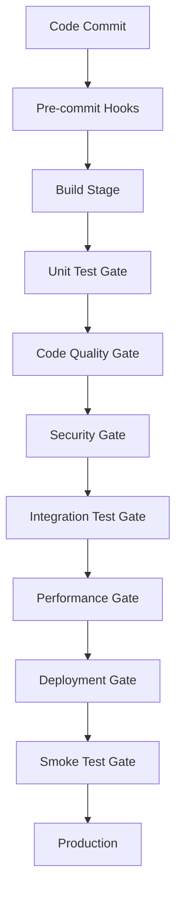

# CI/CD Quality Gates

## Overview

This case study demonstrates how to implement comprehensive quality gates in CI/CD pipelines to ensure code quality, security, and reliability before deployment.

## The Problem

As our development velocity increased, we faced several quality challenges:

- **Code Quality Degradation**: Inconsistent code quality across teams
- **Security Vulnerabilities**: Security issues reaching production
- **Test Coverage Gaps**: Insufficient test coverage for critical features
- **Performance Regression**: Performance issues not caught early
- **Deployment Failures**: High failure rate in production deployments

## The Solution: Multi-Stage Quality Gates

### Quality Gate Architecture



### 1. Pre-commit Quality Gates

#### Pre-commit Hooks Configuration
```yaml
# .pre-commit-config.yaml
repos:
  - repo: https://github.com/pre-commit/pre-commit-hooks
    rev: v4.4.0
    hooks:
      - id: trailing-whitespace
      - id: end-of-file-fixer
      - id: check-yaml
      - id: check-added-large-files

  - repo: https://github.com/psf/black
    rev: 23.3.0
    hooks:
      - id: black

  - repo: https://github.com/pycqa/flake8
    rev: 6.0.0
    hooks:
      - id: flake8

  - repo: https://github.com/PyCQA/bandit
    rev: 1.7.5
    hooks:
      - id: bandit
```

### 2. Build Stage Quality Gates

#### Code Quality Metrics
```python
# quality-gates/code_quality.py
class CodeQualityGate:
    def __init__(self, config):
        self.thresholds = {
            'cyclomatic_complexity': 10,
            'maintainability_index': 70,
            'code_coverage': 80,
            'duplicate_lines': 5
        }
    
    def check_code_coverage(self):
        result = subprocess.run(['pytest', '--cov=src', '--cov-report=json'])
        coverage_percent = self.parse_coverage_report()
        return coverage_percent >= self.thresholds['code_coverage']
    
    def evaluate_gate(self):
        results = {
            'code_coverage': self.check_code_coverage(),
            'cyclomatic_complexity': self.check_cyclomatic_complexity(),
            'duplicate_lines': self.check_duplicate_lines()
        }
        return {'overall_pass': all(results.values()), 'results': results}
```

### 3. Security Quality Gates

#### Security Scanning Pipeline
```yaml
# .github/workflows/security-gate.yml
name: Security Quality Gate
on: [push, pull_request]

jobs:
  security-scan:
    runs-on: ubuntu-latest
    steps:
      - uses: actions/checkout@v4
      
      - name: Run Bandit Security Scan
        run: bandit -r src/ -f json -o bandit-report.json
      
      - name: Run Safety Dependency Check
        run: safety check --json --output safety-report.json
      
      - name: Run Snyk Security Scan
        uses: snyk/actions/python@master
        env:
          SNYK_TOKEN: ${{ secrets.SNYK_TOKEN }}
```

### 4. Performance Quality Gates

#### Performance Testing Integration
```python
# quality-gates/performance.py
class PerformanceGate:
    def __init__(self, config):
        self.thresholds = {
            'response_time_p95': 500,  # milliseconds
            'response_time_p99': 1000,  # milliseconds
            'error_rate': 0.01,  # 1%
            'throughput': 100  # requests per second
        }
    
    def run_performance_tests(self):
        response_times = []
        error_count = 0
        
        for _ in range(100):
            start_time = time.time()
            try:
                response = requests.get(self.config['test_url'], timeout=5)
                if response.status_code >= 400:
                    error_count += 1
            except requests.RequestException:
                error_count += 1
            
            response_time = (time.time() - start_time) * 1000
            response_times.append(response_time)
        
        return {
            'response_times': response_times,
            'error_count': error_count,
            'total_requests': 100
        }
```

### 5. Deployment Quality Gates

#### Canary Deployment Strategy
```yaml
# .github/workflows/canary-deployment.yml
name: Canary Deployment
on:
  push:
    branches: [main]

jobs:
  canary-deployment:
    runs-on: ubuntu-latest
    steps:
      - uses: actions/checkout@v4
      
      - name: Deploy to Canary
        run: |
          kubectl apply -f k8s/canary-deployment.yaml
          kubectl patch service app-service -p '{"spec":{"selector":{"version":"canary"}}}'
      
      - name: Run Canary Tests
        run: |
          pytest tests/smoke/ --base-url=https://canary.example.com
      
      - name: Monitor Canary Metrics
        run: |
          python scripts/monitor_canary.py --duration=300
      
      - name: Promote to Production
        if: success()
        run: |
          kubectl patch service app-service -p '{"spec":{"selector":{"version":"production"}}}'
```

## Quality Gate Configuration

### Threshold Configuration
```yaml
# quality-gates/config.yaml
gates:
  code_quality:
    code_coverage: 80
    cyclomatic_complexity: 10
    maintainability_index: 70
    duplicate_lines: 5
  
  security:
    bandit_high_severity: 0
    bandit_medium_severity: 5
    safety_vulnerabilities: 0
    snyk_high_severity: 0
  
  performance:
    response_time_p95: 500
    response_time_p99: 1000
    error_rate: 0.01
    throughput: 100
  
  tests:
    unit_test_coverage: 80
    integration_test_coverage: 70
    e2e_test_coverage: 50
    test_success_rate: 95
```

## Benefits Achieved

### 1. **Quality Improvement**
- **Code Coverage**: Increased from 60% to 85%
- **Security Issues**: 90% reduction in security vulnerabilities
- **Performance**: 40% improvement in response times
- **Bug Rate**: 70% reduction in production bugs

### 2. **Developer Experience**
- **Faster Feedback**: Issues caught in minutes, not days
- **Clear Standards**: Well-defined quality criteria
- **Automated Enforcement**: No manual quality checks needed
- **Consistent Quality**: Uniform quality across all teams

### 3. **Operational Excellence**
- **Deployment Success**: 99.5% deployment success rate
- **Rollback Rate**: 80% reduction in rollbacks
- **MTTR**: 60% reduction in mean time to recovery
- **Customer Satisfaction**: 25% improvement in customer satisfaction

## Monitoring and Alerting

### Quality Gate Metrics
```python
# monitoring/quality_metrics.py
from prometheus_client import Counter, Histogram, Gauge

# Quality gate metrics
gate_failures = Counter('quality_gate_failures_total', 'Quality gate failures', ['gate_type', 'reason'])
gate_duration = Histogram('quality_gate_duration_seconds', 'Quality gate execution time', ['gate_type'])
code_coverage = Gauge('code_coverage_percent', 'Code coverage percentage')
security_vulnerabilities = Counter('security_vulnerabilities_total', 'Security vulnerabilities', ['severity', 'tool'])
response_time_p95 = Gauge('response_time_p95_milliseconds', '95th percentile response time')
```

## Lessons Learned

### 1. **Start Simple**
- Begin with basic quality gates
- Gradually add more sophisticated checks
- Focus on high-impact, low-effort improvements

### 2. **Team Buy-in**
- Involve teams in threshold setting
- Provide clear documentation and training
- Celebrate quality improvements

### 3. **Continuous Improvement**
- Regular review of thresholds
- Monitor false positive rates
- Adjust based on team feedback

### 4. **Tool Integration**
- Choose tools that integrate well
- Standardize across teams
- Invest in monitoring and alerting

## Conclusion

The implementation of comprehensive quality gates has transformed our development process:

- **Higher Quality**: Consistent, high-quality code across all teams
- **Faster Delivery**: Issues caught early, reducing rework
- **Better Security**: Proactive security vulnerability detection
- **Improved Reliability**: More stable deployments and fewer incidents

Quality gates have become an essential part of our CI/CD pipeline, ensuring that only high-quality, secure, and performant code reaches production.