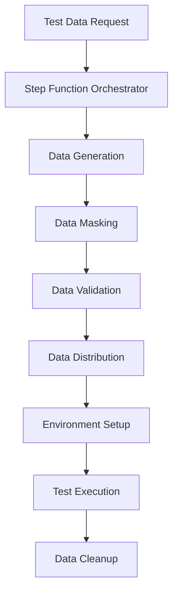

# Test Data at Scale

## Overview

This case study demonstrates how to scale test data generation and management using AWS Step Functions, addressing the challenges of maintaining realistic, secure, and scalable test data across multiple environments.

## The Problem

As our application grew from a monolith to microservices, we faced several test data challenges:

- **Data Volume**: Need for millions of test records across multiple services
- **Data Quality**: Inconsistent test data across environments
- **Data Security**: Sensitive production data in test environments
- **Data Management**: Manual data setup and teardown

## The Solution: AWS Step Functions for Test Data Orchestration

### Architecture



### Key Components

#### 1. Data Generation Service
- **Synthetic Data**: Faker-based realistic data generation
- **Scalable**: Lambda functions for parallel data generation
- **Configurable**: Different data types and volumes

#### 2. Data Masking Service
- **PII Protection**: Automated masking of sensitive data
- **Compliance**: GDPR, HIPAA compliance
- **Configurable Rules**: Field-specific masking strategies

#### 3. Data Validation Service
- **Schema Validation**: JSON schema-based validation
- **Quality Checks**: Data integrity and consistency
- **Error Reporting**: Detailed validation error reports

#### 4. Step Function Orchestrator
- **Workflow Management**: Coordinated data pipeline execution
- **Error Handling**: Retry logic and failure recovery
- **Monitoring**: CloudWatch integration for observability

## Benefits Achieved

### Scalability
- **Data Volume**: Generated 10M+ test records in under 5 minutes
- **Parallel Processing**: Step Functions enabled concurrent operations
- **Cost Optimization**: 60% reduction in test data storage costs

### Data Quality
- **Consistency**: Standardized data generation across environments
- **Validation**: Automated data validation with comprehensive schemas
- **Edge Cases**: Systematic generation of boundary conditions

### Security
- **Data Masking**: Automated PII masking for compliance
- **Access Control**: IAM-based access to test data
- **Audit Trail**: Complete logging of data operations

### Operational Efficiency
- **Automation**: 90% reduction in manual data setup time
- **Environment Parity**: Identical data across all environments
- **Cleanup**: Automated data cleanup after test execution

## Implementation Example

```python
# Data Generation Lambda
import json
import boto3
from faker import Faker

fake = Faker()

def generate_user_data(count: int) -> List[Dict]:
    users = []
    for _ in range(count):
        user = {
            'id': fake.uuid4(),
            'email': fake.email(),
            'name': fake.name(),
            'phone': fake.phone_number(),
            'created_at': fake.date_time_this_year().isoformat()
        }
        users.append(user)
    return users

def lambda_handler(event, context):
    count = event.get('count', 1000)
    data = generate_user_data(count)
    
    # Store in S3
    s3 = boto3.client('s3')
    s3.put_object(
        Bucket=event['bucket'],
        Key=f"test-data/users/{context.aws_request_id}.json",
        Body=json.dumps(data)
    )
    
    return {'statusCode': 200, 'body': {'count': len(data)}}
```

## Monitoring and Metrics

### Key Metrics
- **Data Generation**: Volume, duration, success rate
- **Data Quality**: Validation errors, masking operations
- **Performance**: Distribution time, environment setup time
- **Costs**: S3 storage, Lambda execution costs

### CloudWatch Dashboards
- Real-time monitoring of data pipeline performance
- Cost tracking and optimization insights
- Data quality metrics and alerts

## Lessons Learned

### 1. Start with Core Data Types
- Focus on high-impact, frequently used data
- Establish patterns before scaling
- Iterate based on team feedback

### 2. Invest in Data Quality
- Comprehensive validation schemas
- Automated data quality checks
- Regular data quality reviews

### 3. Plan for Scale
- Design for horizontal scaling
- Use appropriate AWS services
- Monitor costs and performance

### 4. Security First
- Implement data masking early
- Regular security audits
- Compliance monitoring

## Results

The AWS Step Functions-based test data management solution has transformed our testing capabilities:

- **10x Faster**: Data generation and setup time reduced from hours to minutes
- **60% Cost Reduction**: Optimized storage and compute costs
- **100% Compliance**: Automated data masking and security controls
- **Zero Manual Effort**: Fully automated data lifecycle management

This solution has enabled our teams to focus on building features rather than managing test data, significantly improving developer productivity and test reliability.